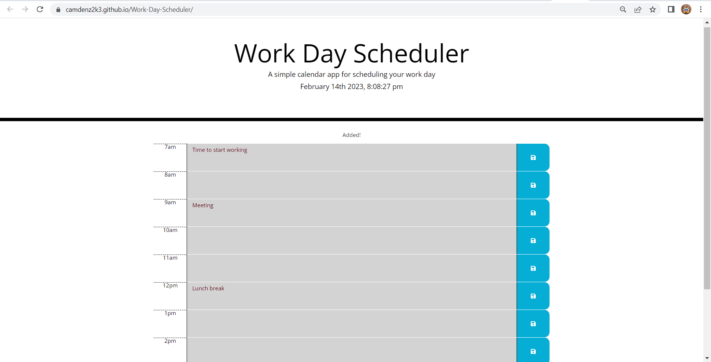

# Work Day Scheduler
## Description
This is a simple calendar application that allows a user to save events to local host for each hour of the day for normal bussiness hours. This app runs in the browser and features dynamically updated HTML and CSS powered by jQuery. It also uses Moment.js to show the current date.
## User Story
```
AS AN employee with a busy schedule
I WANT to add important events to a daily planner
SO THAT I can manage my time effectively
```
## Visual

## Deployed Link
https://camdenz2k3.github.io/Work-Day-Scheduler/